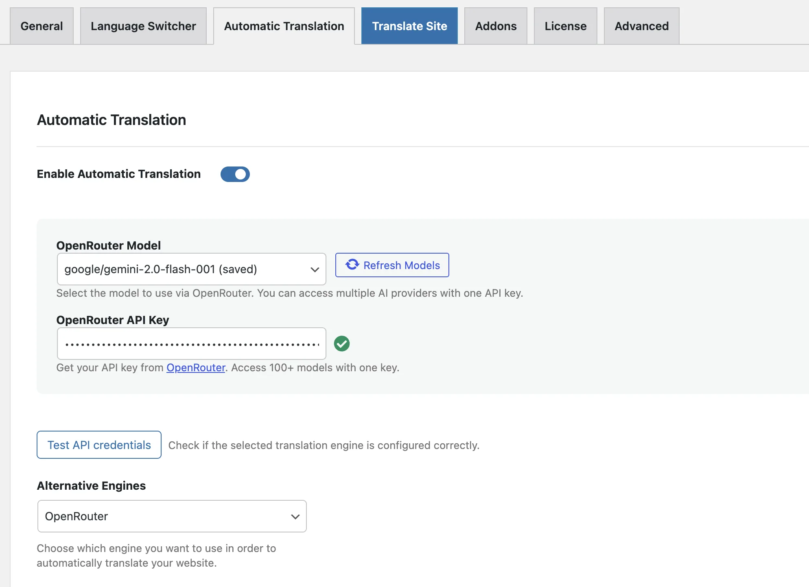

# TranslatePress - LLM Translation Engines

**Version:** 1.0.0  
**Author:** Livvux (https://livvux.com)  
**License:** GPL2  
**Requires:** WordPress 5.0+, PHP 7.4+

## About This Plugin

This is an addon for TranslatePress that adds AI-powered translation capabilities using modern Large Language Models (LLMs). It extends TranslatePress with three major AI translation engines:

- **OpenAI** (GPT-4, GPT-4o, GPT-3.5 Turbo)
- **Anthropic** (Claude 3.5 Sonnet, Claude 3 Opus, Claude 3 Haiku)
- **OpenRouter** (Unified access to 100+ AI models)

## What It Does

TranslatePress - LLM Translation Engines enables you to automatically translate your WordPress website content using state-of-the-art AI models. Instead of traditional machine translation services, you can leverage the power of:

1. **OpenAI's GPT models** - Known for excellent understanding of context and nuance
2. **Anthropic's Claude models** - Highly regarded for natural, human-like translations
3. **OpenRouter's unified API** - Access to multiple AI providers (OpenAI, Anthropic, Google, Meta, Mistral, DeepSeek, and more) from a single interface

## Screenshots

The screenshot shows the Automatic Translation settings page where you can configure your AI translation engines.

## Features

### Multi-Provider Support
- Switch between OpenAI, Anthropic, and OpenRouter with a single setting
- Each provider offers multiple model options with different quality/cost tradeoffs

### Smart Model Selection
- **OpenAI:** GPT-4o Mini (recommended for cost/quality balance), GPT-4o, GPT-4 Turbo, GPT-3.5 Turbo
- **Anthropic:** Claude 3.5 Sonnet (recommended), Claude 3.5 Haiku (fast), Claude 3 Opus
- **OpenRouter:** Access to Claude, GPT, Gemini, Llama, Mistral, DeepSeek, and more

### Intelligent Translation
- Preserves HTML tags and formatting
- Maintains placeholders (%s, %d, {{variables}})
- Handles complex sentence structures and context
- Professional-quality translations suitable for production

### API Key Management
- Secure password fields for API keys
- Real-time API key validation
- Clear error messages for common issues (invalid keys, rate limits, quota exceeded)

### Dynamic Model Loading
- Fetches available models directly from provider APIs
- Displays pricing information per model
- Caches model lists for performance

### Smart Chunking
- Processes translations in batches (default: 25 strings per request)
- Respects TranslatePress quota limits
- Logs all translation requests for debugging

### Cost Transparency
- Displays pricing for each model ($/1M tokens)
- Helps you choose the most cost-effective option
- Compare costs across providers before committing

### UI Enhancements
- Hides TranslatePress AI upsell notices (since you have your own API keys)
- Clean integration with TranslatePress Machine Translation settings
- Model refresh buttons to fetch latest available models

## Requirements

- WordPress 5.0 or higher
- PHP 7.4 or higher
- TranslatePress (free or Pro) - must be installed and activated
- API keys for one or more translation providers:
  - [OpenAI API Key](https://platform.openai.com/api-keys)
  - [Anthropic API Key](https://console.anthropic.com/settings/keys)
  - [OpenRouter API Key](https://openrouter.ai/keys)

## Installation

1. Upload the `translatepress-llm-engines` folder to the `/wp-content/plugins/` directory
2. Activate the plugin through the "Plugins" menu in WordPress
3. Navigate to TranslatePress → Automatic Translation
4. Select your preferred engine (OpenAI, Anthropic, or OpenRouter)
5. Enter your API key
6. Choose a model from the dropdown
7. Save settings and start translating!

## Usage

### 1. Configure the Translation Engine
1. Go to **TranslatePress → Automatic Translation** in your WordPress admin
2. Under "Translation Engine", choose one of:
   - **OpenAI (GPT)** - Best all-around option
   - **Anthropic (Claude)** - Excellent for nuanced translations
   - **OpenRouter** - Access to multiple providers with one key

### 2. Enter API Key
- For OpenAI: Get key from https://platform.openai.com/api-keys
- For Anthropic: Get key from https://console.anthropic.com/settings/keys
- For OpenRouter: Get key from https://openrouter.ai/keys

### 3. Select Model
Each provider offers different models:
- **Recommended models** (marked with ★) offer best value
- Higher-tier models provide better quality but cost more
- Click "Refresh Models" to fetch latest available models

### 4. Translate Content
Use TranslatePress's built-in translation interface:
- Go to the page/post editor
- Use the "Translate" button or translate strings directly
- The LLM will handle the translation automatically

## Supported Languages

The plugin supports translation between 80+ languages including:
- Major languages: English, German, French, Spanish, Italian, Portuguese, Dutch, Russian, Chinese, Japanese, Korean
- European languages: Polish, Swedish, Danish, Finnish, Norwegian, Czech, Greek, Hungarian, Romanian, Ukrainian, Hebrew
- Asian languages: Thai, Vietnamese, Indonesian, Hindi, Bengali, Tamil, Telugu
- Middle Eastern: Arabic, Persian, Urdu
- And many more...

## API Key Security

- API keys are stored securely in WordPress options
- Password fields prevent accidental exposure in admin interface
- Keys are never transmitted to third parties (only to the respective AI provider)
- Never share your API keys publicly

## Cost Considerations

Translation costs depend on:
- **Model selected:** Newer/more powerful models cost more
- **Content volume:** More text = more tokens = higher cost
- **Target languages:** Each target language requires separate translation

Example costs (as of 2024):
- **GPT-4o Mini:** ~$0.15 per million input tokens, $0.60 per million output tokens
- **Claude 3.5 Sonnet:** ~$3.00 per million input tokens, $15.00 per million output tokens
- **Claude 3.5 Haiku:** ~$0.80 per million input tokens, $4.00 per million output tokens

Most websites will find GPT-4o Mini or Claude 3.5 Haiku to be the most cost-effective choices while maintaining high quality.

## Troubleshooting

### "Invalid API Key" Error
- Verify you copied the key correctly (no extra spaces)
- Check that the key is active in your provider's dashboard
- Ensure the key has the necessary permissions

### "Rate Limit Exceeded" Error
- Wait a few minutes before trying again
- Consider upgrading your API plan for higher limits
- Use a different provider temporarily

### Translation Fails
- Check that TranslatePress is activated
- Verify your default language is set correctly
- Check browser console for JavaScript errors
- Review TranslatePress logs for detailed error messages

### Models Not Loading
- Click the "Refresh Models" button
- Check your internet connection
- Verify your API key is valid
- Some providers may require a valid API key to fetch models

## Differences from TranslatePress AI

This addon is **NOT** the same as TranslatePress AI. Here's the difference:

| Feature | TranslatePress AI | This Addon |
|---------|------------------|------------|
| Translation Engine | Proprietary API (paid license) | Your own API keys |
| Cost | License fee + usage | Pay only for API usage |
| Models | Limited selection | Access to 100+ models |
| Transparency | Black-box | Full model control |
| Flexibility | Fixed | Switch providers anytime |

This addon gives you more control, transparency, and often lower costs for high-volume translations.

## Support

For issues or questions:
1. Check the [TranslatePress documentation](https://translatepress.com/docs/)
2. Verify your API keys are valid and have available quota
3. Check WordPress debug logs for detailed error messages
4. Visit [livvux.com](https://livvux.com) for updates and other plugins

## Changelog

### Version 1.0.0 (2024)
- Initial release
- Support for OpenAI (GPT-4, GPT-4o, GPT-3.5)
- Support for Anthropic (Claude 3.5, Claude 3)
- Support for OpenRouter (unified API)
- Dynamic model loading from provider APIs
- API key validation
- Pricing display for each model
- Translation quota management
- Hide TranslatePress AI upsell notices

## License

This plugin is free software: you can redistribute it and/or modify it under the terms of the GNU General Public License as published by the Free Software Foundation, either version 2 of the License, or (at your option) any later version.

This plugin is distributed in the hope that it will be useful, but WITHOUT ANY WARRANTY; without even the implied warranty of MERCHANTABILITY or FITNESS FOR A PARTICULAR PURPOSE. See the GNU General Public License for more details.

You should have received a copy of the GNU General Public License along with this program. If not, see [http://www.gnu.org/licenses/](http://www.gnu.org/licenses/).

## Credits

- Developed by [Livvux](https://livvux.com)
- Built as an addon for [TranslatePress](https://translatepress.com/)
- Powered by [OpenAI](https://openai.com), [Anthropic](https://anthropic.com), and [OpenRouter](https://openrouter.ai)

---

**Made with ❤️ by Livvux - https://livvux.com**
